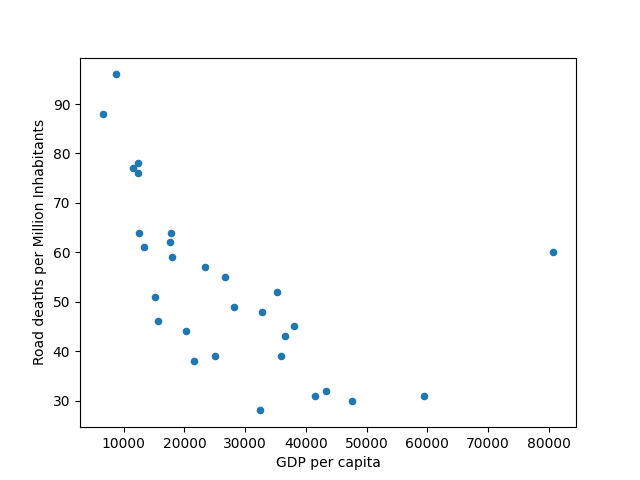
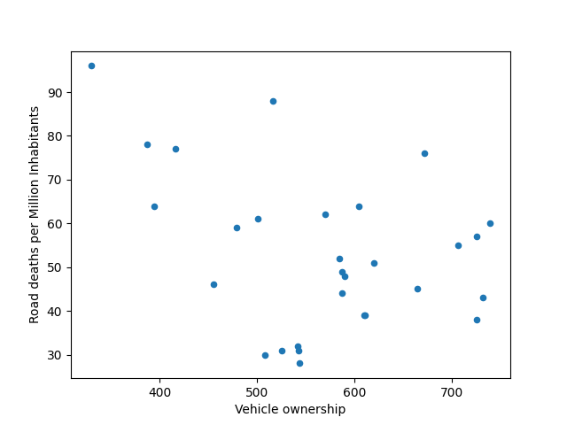

# DATA WRANGLING CHALLENGE

This is the code I've made for the Data Wrangling Challenge - more [here](https://hackmd.io/@datopian/junior-software-engineer-challenge).

## Install

To install, first create and activate your Python virtualenv - the steps may vary depending on your OS.

Then, clone the git repository:
```bash
git clone https://github.com/danielfeloiola/data-wrangler.git
```

Then install the dependencies with:
```bash
pip install -r requirements.txt
```
## Using

To run the script that will create the CSV file:
```bash
python scraper.py
```
The script will generate a CSV file called `data.csv` on the data folder

To run the extra script (to create the plots)
```bash
python extra.py
```
The script will generate two plots called `img1.png` and `img2.png`.
You can also create a HTML report by changing the `profile_report` variable to `True`.

## Extras

The first plot shows the relationship between `GDP per capita` and `Road deaths per Million Inhabitants`.
We can see that there is some correlation, indicating that countries with a higher GDP have fewer deaths per million inhabitants.



The second plot shows the relationship between `GDP per capita` and `Vehicle ownership`.
This time the correlation is not very solid, indicating that more cars don't necessarily increase deaths.

